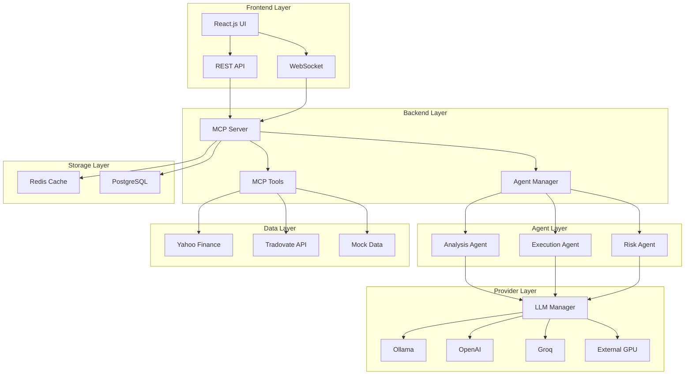

# NQ Trading Agent v2.0 - MCP Architecture

> **Advanced NQ Futures Trading with AI Analysis using Model Context Protocol (MCP)**

A comprehensive, containerized trading system built on MCP (Model Context Protocol) with FastMCP, providing modular AI agents, real-time analysis, and scalable deployment for E-mini NASDAQ-100 (NQ) futures trading.

## 🚀 **Quick Start**

```bash
# Clone and start the entire system
git clone <repository-url>
cd nq_trading_agent
docker-compose up -d

# Access the trading interface
open http://localhost:3000
```

## 📋 **Table of Contents**

1. [Architecture Overview](#architecture-overview)
2. [MCP Server & Tools](#mcp-server--tools)
3. [Agent Framework](#agent-framework)
4. [Context & Prompt Management](#context--prompt-management)
5. [LLM Provider System](#llm-provider-system)
6. [Containerized Deployment](#containerized-deployment)
7. [Web UI Interface](#web-ui-interface)
8. [Data Ingestion](#data-ingestion)
9. [Configuration Management](#configuration-management)
10. [Testing Framework](#testing-framework)
11. [Scaling & External GPUs](#scaling--external-gpus)
12. [API Documentation](#api-documentation)
13. [Troubleshooting](#troubleshooting)

---

## 🏗️ **Architecture Overview**

### System Architecture



### Key Components

| Component | Purpose | Technology |
|-----------|---------|------------|
| **MCP Server** | Core orchestration and tool management | FastMCP |
| **Frontend** | Modern trading interface | React.js, TailwindCSS |
| **Backend API** | REST & WebSocket APIs | FastAPI |
| **Agent Framework** | Specialized AI trading agents | Python, AsyncIO |
| **LLM Manager** | Multi-provider LLM integration | Ollama, OpenAI, Groq |
| **Data Tools** | Market data ingestion & analysis | Yahoo Finance, Tradovate |
| **Storage** | Caching and persistence | Redis, PostgreSQL |

---

## 🔧 **MCP Server & Tools**

### MCP Server Architecture

The MCP (Model Context Protocol) server provides a standardized interface for AI tools and agents:

```python
# Initialize MCP server
from mcp_trading_agent.server import TradingMCPServer

server = TradingMCPServer("config/config.yaml")
await server.start()
```

### Available MCP Tools

#### 🔍 **Data Ingestion Tools**
- `get_nq_price()` - Current NQ futures price and session data
- `get_historical_data()` - Historical OHLCV data with configurable periods
- `get_market_hours()` - Trading session status and hours
- `get_contract_info()` - NQ contract specifications

#### 📊 **Technical Analysis Tools**
- `calculate_technical_indicators()` - RSI, MACD, Bollinger Bands, ATR
- `detect_patterns()` - Head & shoulders, triangles, double tops
- `analyze_momentum()` - Price momentum and volume analysis
- `find_support_resistance()` - Key levels identification

#### ⚡ **Execution Tools**
- `place_order()` - Order placement with risk controls
- `manage_position()` - Position monitoring and adjustment
- `calculate_position_size()` - Risk-based position sizing

#### 🛡️ **Risk Management Tools**
- `assess_portfolio_risk()` - Portfolio-wide risk analysis
- `check_risk_limits()` - Validate against risk parameters
- `calculate_var()` - Value at Risk calculations

#### 📈 **Backtesting Tools**
- `run_backtest()` - Historical strategy testing
- `generate_performance_report()` - Detailed performance metrics
- `compare_strategies()` - Strategy comparison analysis

### Tool Registration

```python
# Register all tools with MCP server
from mcp_trading_agent.tools import register_all_tools

register_all_tools(mcp_server, config)
```

### Custom Tool Development

```python
# Create custom MCP tool
@mcp_server.tool()
async def custom_analysis_tool(data: str, parameters: dict) -> dict:
    """Custom analysis tool implementation."""
    # Tool logic here
    return {"result": "analysis_output"}
```

---

## 🤖 **Agent Framework**

### Agent Architecture

The agent framework provides specialized AI agents for different trading functions:

```python
from mcp_trading_agent.agents import create_agent

# Create specialized agents
analysis_agent = create_agent("analysis", config, mcp_server, provider_manager)
execution_agent = create_agent("execution", config, mcp_server, provider_manager)
risk_agent = create_agent("risk", config, mcp_server, provider_manager)
```

### Agent Types

#### 📊 **Analysis Agent**
- **Specialization**: Technical and fundamental analysis
- **Capabilities**: Pattern recognition, indicator analysis, market sentiment
- **Tools Used**: Data ingestion, technical analysis, pattern detection

```python
# Analysis agent usage
result = await analysis_agent.execute_task({
    "type": "market_analysis",
    "parameters": {
        "symbol": "NQ=F",
        "timeframe": "1h",
        "analysis_depth": "comprehensive"
    }
})
```

#### ⚡ **Execution Agent**
- **Specialization**: Trade execution and order management
- **Capabilities**: Order placement, position monitoring, execution optimization
- **Tools Used**: Execution tools, risk checks, market data

```python
# Execution agent usage
result = await execution_agent.execute_task({
    "type": "place_trade",
    "parameters": {
        "action": "BUY",
        "quantity": 1,
        "price": 23000.0,
        "stop_loss": 22950.0,
        "take_profit": 23100.0
    }
})
```

#### 🛡️ **Risk Agent**
- **Specialization**: Risk assessment and management
- **Capabilities**: Portfolio risk analysis, position sizing, drawdown monitoring
- **Tools Used**: Risk management tools, portfolio analysis, VaR calculations

```python
# Risk agent usage
result = await risk_agent.execute_task({
    "type": "assess_risk",
    "parameters": {
        "portfolio": current_positions,
        "market_conditions": market_data
    }
})
```

### Agent Communication

Agents can communicate and coordinate through the MCP server:

```python
# Multi-agent workflow
analysis_result = await analysis_agent.analyze_market()
risk_assessment = await risk_agent.assess_trade(analysis_result)
execution_result = await execution_agent.execute_trade(risk_assessment)
```

### Agent Memory & Context

Each agent maintains memory and context for continuity:

```python
# Agent memory access
agent.update_context({"last_analysis": analysis_result})
recent_memory = agent.get_recent_memory(10)
analysis_history = agent.get_memory_by_type("llm_analysis", 5)
```

---

## 🎯 **Context & Prompt Management**

### Prompt Template Engine

Advanced prompt templating for consistent AI interactions:

```python
from mcp_trading_agent.context import PromptTemplateEngine

template_engine = PromptTemplateEngine()

# Generate specialized prompts
prompt = template_engine.generate_prompt(
    template_name="analysis_base",
    context={
        "market_data": current_market_data,
        "technical_indicators": indicators,
        "request": "Analyze current NQ market conditions"
    },
    agent_type="analysis",
    tools=["get_nq_price", "calculate_technical_indicators"]
)
```

### Available Templates

#### Analysis Templates
- `analysis_base` - Core technical analysis prompt
- `pattern_recognition` - Chart pattern analysis
- `market_summary` - Concise market overview

#### Execution Templates
- `execution_base` - Trade execution instructions
- `risk_assessment` - Risk evaluation prompt
- `order_management` - Order handling guidance

#### Custom Templates

```python
# Add custom template
template_engine.add_template("custom_analysis", """
You are analyzing {symbol} futures with the following conditions:
{market_conditions}

Provide analysis focusing on {analysis_focus}.
""")
```

### Context Management

Dynamic context building for relevant AI responses:

```python
from mcp_trading_agent.context import ContextManager

context_manager = ContextManager()

# Build context from multiple sources
context = context_manager.build_context([
    "current_market_data",
    "recent_trades", 
    "risk_parameters",
    "agent_memory"
])
```

### Memory Management

Persistent memory across agent sessions:

```python
from mcp_trading_agent.context import MemoryManager

memory_manager = MemoryManager()

# Store and retrieve agent memories
memory_manager.store_memory(agent_id, "analysis", analysis_result)
historical_analyses = memory_manager.get_memory(agent_id, "analysis", days=7)
```

---

## 🧠 **LLM Provider System**

### Multi-Provider Architecture

Support for multiple LLM providers with automatic failover:

```python
from mcp_trading_agent.providers import LLMProviderManager

# Initialize provider manager
provider_manager = LLMProviderManager(config)
await provider_manager.initialize()

# Generate response with automatic provider selection
response = await provider_manager.generate_response(
    prompt="Analyze current NQ market conditions",
    provider="ollama",  # Optional: specify provider
    model="phi3:mini"   # Optional: specify model
)
```

### Supported Providers

#### 🏠 **Ollama (Local Models)**
```yaml
ollama:
  enabled: true
  host: "http://localhost:11434"
  models:
    - name: "phi3:mini"
      context_length: 4096
      capabilities: ["chat", "analysis"]
    - name: "gemma3:4b"
      context_length: 8192
      capabilities: ["chat", "analysis", "reasoning"]
```

#### ☁️ **OpenAI (Cloud API)**
```yaml
openai:
  enabled: true
  api_key: "${OPENAI_API_KEY}"
  models:
    - name: "gpt-4o-mini"
      context_length: 16384
      capabilities: ["chat", "analysis", "reasoning", "function_calling"]
```

#### ⚡ **Groq (Fast Inference)**
```yaml
groq:
  enabled: true
  api_key: "${GROQ_API_KEY}"
  models:
    - name: "llama3-70b-8192"
      context_length: 8192
      capabilities: ["chat", "analysis"]
```

#### 🖥️ **External GPU Servers**
```yaml
external_gpu:
  enabled: true
  endpoints:
    - name: "local_gpu_server"
      url: "http://gpu-server:8001/v1"
      api_key: "${GPU_SERVER_API_KEY}"
      models: ["llama3-70b", "mixtral-8x7b"]
```

### Provider Features

#### Automatic Failover
```python
# Primary provider fails -> automatic fallback
response = await provider_manager.generate_response(
    prompt="Analyze market",
    provider="openai"  # If fails, tries other providers
)
```

#### Load Balancing
```python
# Distribute requests across providers
best_provider = provider_manager.get_best_model_for_task("technical_analysis")
response = await provider_manager.generate_response(
    prompt="Technical analysis request",
    provider=best_provider["provider"],
    model=best_provider["model"]
)
```

#### Health Monitoring
```python
# Check provider health
status = provider_manager.get_status()
print(f"Healthy providers: {status['healthy_providers']}/{status['total_providers']}")
```

### Custom Provider Integration

```python
from mcp_trading_agent.providers.base import BaseLLMProvider

class CustomProvider(BaseLLMProvider):
    async def generate_response(self, prompt: str, **kwargs) -> str:
        # Custom provider implementation
        return await self.custom_api_call(prompt)
```

---

## 🐳 **Containerized Deployment**

### Docker Architecture

The system is designed for containerized deployment with Docker Compose:

```yaml
# docker-compose.yml
services:
  frontend:    # React.js UI
  backend:     # FastAPI + MCP Server  
  ollama:      # Local LLM Server
  redis:       # Caching Layer
  postgres:    # Data Storage
  nginx:       # Load Balancer
```

### Quick Deployment

```bash
# Start the entire system
docker-compose up -d

# View logs
docker-compose logs -f

# Scale specific services
docker-compose up -d --scale backend=3

# Stop the system
docker-compose down
```

### Service Configuration

#### Frontend Service
```yaml
frontend:
  build: ./frontend
  ports:
    - "3000:3000"
  environment:
    - REACT_APP_API_URL=http://localhost:8000
  volumes:
    - ./frontend/src:/app/src
```

#### Backend Service
```yaml
backend:
  build: .
  ports:
    - "8000:8000"
  environment:
    - OLLAMA_HOST=http://ollama:11434
  volumes:
    - ./mcp_trading_agent:/app/mcp_trading_agent
    - ./logs:/app/logs
```

#### Ollama Service
```yaml
ollama:
  image: ollama/ollama:latest
  ports:
    - "11434:11434"
  volumes:
    - ollama_data:/root/.ollama
```

### Environment Configuration

Create `.env` file for environment-specific settings:

```bash
# .env
OPENAI_API_KEY=your_openai_key
GROQ_API_KEY=your_groq_key
TRADOVATE_API_KEY=your_tradovate_key
POSTGRES_PASSWORD=your_secure_password
REDIS_PASSWORD=your_redis_password
```

### Production Deployment

For production environments:

```bash
# Use production compose file
docker-compose -f docker-compose.prod.yml up -d

# Enable SSL/TLS
cp ssl/cert.pem nginx/ssl/
cp ssl/key.pem nginx/ssl/
```

### Scaling Strategies

#### Horizontal Scaling
```bash
# Scale backend instances
docker-compose up -d --scale backend=5

# Scale with external load balancer
docker-compose up -d --scale nginx=2
```

#### Vertical Scaling
```yaml
# Increase resource limits
backend:
  deploy:
    resources:
      limits:
        cpus: '2.0'
        memory: 4G
```

---

## 🌐 **Web UI Interface**

### Frontend Architecture

Modern React.js interface with real-time updates:

```javascript
// React component structure
src/
├── components/          # Reusable UI components
├── pages/              # Main application pages
├── store/              # Redux state management
├── context/            # React context providers
├── services/           # API communication
└── utils/              # Utility functions
```

### Key Features

#### Real-Time Market Data
- Live NQ futures prices
- Interactive trading charts
- Technical indicator overlays
- Volume and momentum displays

#### Agent Management
- Create and configure agents
- Monitor agent status and performance
- View agent communication logs
- Manage agent memory and context

#### Analysis Interface
- Interactive analysis requests
- Real-time AI responses
- Historical analysis archive
- Customizable analysis parameters

#### Configuration Management
- Dynamic configuration updates
- Provider switching interface
- Risk parameter adjustment
- Tool configuration

#### Backtesting Suite
- Historical strategy testing
- Performance visualization
- Strategy comparison tools
- Risk-adjusted metrics

### Component Examples

#### Market Data Dashboard
```javascript
import React from 'react';
import { useSelector } from 'react-redux';
import MarketDataCard from '../components/MarketDataCard';

const Dashboard = () => {
  const marketData = useSelector(state => state.trading.marketData);
  
  return (
    <div className="dashboard">
      <MarketDataCard data={marketData} />
      <TradingChart symbol="NQ=F" />
      <AgentStatus />
    </div>
  );
};
```

#### WebSocket Integration
```javascript
import { useContext, useEffect } from 'react';
import { WebSocketContext } from '../context/WebSocketContext';

const RealTimeComponent = () => {
  const { socket } = useContext(WebSocketContext);
  
  useEffect(() => {
    socket.on('market_update', (data) => {
      // Handle real-time market updates
    });
  }, [socket]);
};
```

### Responsive Design

The interface is fully responsive and optimized for:
- Desktop trading workstations
- Tablet interfaces
- Mobile monitoring

### Theme Customization

```javascript
// Tailwind CSS configuration
module.exports = {
  theme: {
    extend: {
      colors: {
        trading: {
          green: '#10B981',
          red: '#EF4444',
          blue: '#3B82F6'
        }
      }
    }
  }
};
```

---

## 📊 **Data Ingestion**

### Data Sources

#### Yahoo Finance Integration
```python
# Real-time NQ data
data = await mcp_server.use_tool("get_nq_price", symbol="NQ=F")
historical = await mcp_server.use_tool(
    "get_historical_data",
    symbol="NQ=F",
    period="1d",
    interval="5m"
)
```

#### Tradovate API (Professional)
```yaml
tradovate:
  enabled: true
  api_key: "${TRADOVATE_API_KEY}"
  account_id: "${TRADOVATE_ACCOUNT_ID}"
  demo: true  # Use demo environment
```

#### Mock Data (Testing)
```python
# Generate realistic test data
mock_data = await mcp_server.use_tool(
    "generate_mock_data",
    symbol="NQ",
    start_price=23000.0,
    volatility=0.02,
    periods=100
)
```

### Data Processing Pipeline

#### Real-Time Processing
```python
async def process_market_data():
    while True:
        # Fetch current data
        data = await get_market_data()
        
        # Process through agents
        analysis = await analysis_agent.process(data)
        risk_check = await risk_agent.evaluate(analysis)
        
        # Execute if conditions met
        if risk_check["approved"]:
            await execution_agent.execute(analysis)
        
        await asyncio.sleep(60)  # Process every minute
```

#### Data Validation
```python
def validate_ohlcv_data(data):
    """Validate OHLCV data integrity."""
    assert all(data['high'] >= data['low'])
    assert all(data['high'] >= data['open'])
    assert all(data['high'] >= data['close'])
    assert all(data['volume'] >= 0)
    return True
```

#### Caching Strategy
```python
# Redis caching for performance
@cache_result(ttl=300)  # 5-minute cache
async def get_technical_indicators(symbol, period):
    """Cached technical indicator calculation."""
    data = await fetch_market_data(symbol, period)
    return calculate_indicators(data)
```

### Data Quality Assurance

#### Outlier Detection
```python
def detect_price_outliers(data, threshold=3.0):
    """Detect and flag price outliers."""
    z_scores = np.abs(stats.zscore(data['close']))
    outliers = data[z_scores > threshold]
    return outliers
```

#### Missing Data Handling
```python
def handle_missing_data(data):
    """Handle missing or invalid data points."""
    # Forward fill for price data
    data['close'].fillna(method='ffill', inplace=True)
    
    # Interpolate volume data
    data['volume'].interpolate(inplace=True)
    
    return data
```

---

## ⚙️ **Configuration Management**

### Configuration Architecture

Hierarchical configuration system with environment variable support:

```yaml
# config/config.yaml
mcp:
  server:
    host: "0.0.0.0"
    port: 8000

llm:
  default_provider: "ollama"
  providers:
    ollama:
      enabled: true
      host: "${OLLAMA_HOST:-http://localhost:11434}"

trading:
  risk:
    max_position_size_pct: 2.0
    stop_loss_pct: 0.5
```

### Dynamic Configuration

Runtime configuration updates without restart:

```python
# Update configuration dynamically
await mcp_server.update_config({
    "trading": {
        "risk": {
            "max_position_size_pct": 1.5
        }
    }
})
```

### Environment-Specific Configs

```bash
# Development
export CONFIG_ENV=development
export OLLAMA_HOST=http://localhost:11434

# Production  
export CONFIG_ENV=production
export OLLAMA_HOST=http://ollama-cluster:11434
```

### Configuration Validation

```python
from pydantic import BaseModel, Field

class TradingConfig(BaseModel):
    max_position_size_pct: float = Field(gt=0, le=10)
    stop_loss_pct: float = Field(gt=0, le=5)
    
    class Config:
        validate_assignment = True
```

### Security Best Practices

```yaml
# Use environment variables for secrets
api_keys:
  openai: "${OPENAI_API_KEY}"
  tradovate: "${TRADOVATE_API_KEY}"

# Encrypt sensitive configuration
encrypted_config:
  trading_account: "${ENCRYPTED_ACCOUNT_INFO}"
```

---

## 🧪 **Testing Framework**

### Test Architecture

Comprehensive testing across all system components:

```python
# Test structure
tests/
├── unit/               # Unit tests for individual components
├── integration/        # Integration tests for component interaction
├── mcp/               # MCP tool and server tests
├── agents/            # Agent behavior tests
├── providers/         # LLM provider tests
├── api/               # API endpoint tests
└── e2e/               # End-to-end system tests
```

### MCP Tool Testing

```python
import pytest
from mcp_trading_agent.server import TradingMCPServer

@pytest.mark.asyncio
async def test_get_nq_price_tool():
    """Test NQ price retrieval tool."""
    server = TradingMCPServer("test_config.yaml")
    
    result = await server.mcp.call_tool("get_nq_price")
    
    assert "current_price" in result
    assert isinstance(result["current_price"], float)
    assert result["current_price"] > 0
```

### Agent Testing

```python
@pytest.mark.asyncio
async def test_analysis_agent():
    """Test analysis agent functionality."""
    agent = create_agent("analysis", test_config, mcp_server, provider_manager)
    
    task = {
        "type": "market_analysis",
        "parameters": {"symbol": "NQ=F"}
    }
    
    result = await agent.execute_task(task)
    
    assert "analysis" in result
    assert "confidence" in result
    assert 0 <= result["confidence"] <= 10
```

### Provider Testing

```python
@pytest.mark.asyncio
async def test_ollama_provider():
    """Test Ollama provider integration."""
    provider = OllamaProvider("ollama", test_config)
    await provider.initialize()
    
    response = await provider.generate_response("Test prompt")
    
    assert isinstance(response, str)
    assert len(response) > 0
```

### Integration Testing

```python
@pytest.mark.asyncio
async def test_full_analysis_workflow():
    """Test complete analysis workflow."""
    # Get market data
    market_data = await mcp_server.use_tool("get_nq_price")
    
    # Run analysis
    analysis = await analysis_agent.analyze_market(market_data)
    
    # Check risk
    risk_assessment = await risk_agent.assess_trade(analysis)
    
    assert risk_assessment["approved"] in [True, False]
```

### Performance Testing

```python
@pytest.mark.performance
async def test_response_time():
    """Test system response times."""
    start_time = time.time()
    
    result = await mcp_server.use_tool("get_nq_price")
    
    response_time = time.time() - start_time
    assert response_time < 2.0  # Max 2 seconds
```

### Test Data Management

```python
# Generate test data
def generate_test_market_data():
    """Generate realistic test market data."""
    dates = pd.date_range("2024-01-01", periods=100, freq="1H")
    
    return pd.DataFrame({
        "open": np.random.normal(23000, 100, 100),
        "high": np.random.normal(23020, 100, 100),
        "low": np.random.normal(22980, 100, 100),
        "close": np.random.normal(23000, 100, 100),
        "volume": np.random.randint(1000, 5000, 100)
    }, index=dates)
```

### Continuous Testing

```yaml
# GitHub Actions CI/CD
name: Test Suite
on: [push, pull_request]

jobs:
  test:
    runs-on: ubuntu-latest
    steps:
      - uses: actions/checkout@v2
      - name: Run tests
        run: |
          docker-compose -f docker-compose.test.yml up --abort-on-container-exit
```

---

## 🚀 **Scaling & External GPUs**

### GPU Server Integration

Support for external GPU servers and cloud compute:

#### Local GPU Server Setup
```yaml
# docker-compose.gpu.yml
gpu-server:
  image: nvidia/cuda:11.8-runtime-ubuntu20.04
  runtime: nvidia
  environment:
    - NVIDIA_VISIBLE_DEVICES=all
  ports:
    - "8001:8001"
  volumes:
    - ./gpu-models:/models
```

#### Cloud GPU Integration
```python
# External GPU provider configuration
external_gpu:
  endpoints:
    - name: "aws_gpu"
      url: "https://api.aws-gpu-cluster.com/v1"
      api_key: "${AWS_GPU_API_KEY}"
      models: ["llama3-70b", "gpt-4-turbo"]
    
    - name: "gcp_gpu"  
      url: "https://api.gcp-gpu-cluster.com/v1"
      api_key: "${GCP_GPU_API_KEY}"
      models: ["mixtral-8x7b", "claude-3"]
```

### Horizontal Scaling

#### Load Balancing
```yaml
# nginx/nginx.conf
upstream backend {
    server backend1:8000;
    server backend2:8000;
    server backend3:8000;
}
```

#### Auto-Scaling
```yaml
# kubernetes/deployment.yaml
apiVersion: apps/v1
kind: Deployment
metadata:
  name: trading-backend
spec:
  replicas: 3
  template:
    spec:
      containers:
      - name: backend
        image: trading-agent:latest
        resources:
          requests:
            cpu: 500m
            memory: 1Gi
          limits:
            cpu: 2000m
            memory: 4Gi
---
apiVersion: autoscaling/v2
kind: HorizontalPodAutoscaler
metadata:
  name: backend-hpa
spec:
  scaleTargetRef:
    apiVersion: apps/v1
    kind: Deployment
    name: trading-backend
  minReplicas: 2
  maxReplicas: 10
  metrics:
  - type: Resource
    resource:
      name: cpu
      target:
        type: Utilization
        averageUtilization: 70
```

### Performance Optimization

#### Caching Strategies
```python
# Multi-level caching
@redis_cache(ttl=300)
@memory_cache(ttl=60)
async def get_market_analysis(symbol, timeframe):
    """Cached market analysis with multiple cache levels."""
    return await perform_analysis(symbol, timeframe)
```

#### Async Processing
```python
# Parallel processing
async def process_multiple_symbols():
    """Process multiple symbols concurrently."""
    symbols = ["NQ=F", "ES=F", "YM=F"]
    
    tasks = [
        analyze_symbol(symbol) 
        for symbol in symbols
    ]
    
    results = await asyncio.gather(*tasks)
    return results
```

#### Resource Management
```python
# Connection pooling
class ProviderPool:
    def __init__(self, max_connections=10):
        self.pool = asyncio.Semaphore(max_connections)
    
    async def generate_response(self, prompt):
        async with self.pool:
            return await self.provider.generate(prompt)
```

### Monitoring & Observability

#### Metrics Collection
```python
from prometheus_client import Counter, Histogram, Gauge

# Define metrics
request_count = Counter('trading_requests_total', 'Total requests')
response_time = Histogram('trading_response_seconds', 'Response time')
active_agents = Gauge('trading_active_agents', 'Number of active agents')

# Instrument code
@response_time.time()
async def handle_request():
    request_count.inc()
    # Process request
```

#### Health Checks
```python
@app.get("/health")
async def health_check():
    """Comprehensive health check."""
    health_status = {
        "mcp_server": await check_mcp_health(),
        "llm_providers": await check_provider_health(),
        "database": await check_db_health(),
        "external_apis": await check_api_health()
    }
    
    overall_health = all(health_status.values())
    return {
        "status": "healthy" if overall_health else "unhealthy",
        "components": health_status
    }
```

---

## 📚 **API Documentation**

### REST API Endpoints

#### Market Data
```http
GET /api/market/nq-price
```
Get current NQ futures price and session data.

**Response:**
```json
{
  "symbol": "NQ=F",
  "current_price": 23006.75,
  "session_high": 23021.50,
  "session_low": 22863.00,
  "volume": 268851,
  "timestamp": "2024-01-15T14:30:00Z"
}
```

#### Historical Data
```http
GET /api/market/historical?symbol=NQ=F&period=1d&interval=5m
```

**Parameters:**
- `symbol`: Futures symbol (default: NQ=F)
- `period`: Data period (1d, 5d, 1mo, 3mo, 6mo, 1y)
- `interval`: Data interval (1m, 5m, 15m, 30m, 1h, 1d)

#### Agent Management
```http
POST /api/agents
Content-Type: application/json

{
  "agent_type": "analysis",
  "config": {
    "provider": "ollama",
    "model": "phi3:mini",
    "temperature": 0.1
  }
}
```

**Response:**
```json
{
  "agent_id": "analysis_20240115_143022",
  "status": "created"
}
```

#### Execute Agent Task
```http
POST /api/agents/{agent_id}/tasks
Content-Type: application/json

{
  "task_type": "market_analysis",
  "parameters": {
    "symbol": "NQ=F",
    "timeframe": "1h",
    "analysis_depth": "comprehensive"
  }
}
```

### WebSocket API

#### Connection
```javascript
const socket = io('ws://localhost:8000');

socket.on('connect', () => {
  console.log('Connected to trading agent');
});
```

#### Real-Time Updates
```javascript
// Market data updates
socket.on('market_update', (data) => {
  console.log('Market update:', data);
});

// Agent status updates  
socket.on('agent_update', (data) => {
  console.log('Agent update:', data);
});

// System notifications
socket.on('system_notification', (data) => {
  console.log('System notification:', data);
});
```

### MCP Tool API

#### Direct Tool Usage
```python
# Use MCP tools directly
result = await mcp_server.mcp.call_tool(
    "calculate_technical_indicators",
    data=json.dumps(market_data),
    indicators=["sma_20", "rsi_14", "macd"]
)
```

#### Batch Tool Execution
```python
# Execute multiple tools
tasks = [
    mcp_server.mcp.call_tool("get_nq_price"),
    mcp_server.mcp.call_tool("calculate_technical_indicators", data=data),
    mcp_server.mcp.call_tool("detect_patterns", data=data)
]

results = await asyncio.gather(*tasks)
```

---

## 🔧 **Troubleshooting**

### Common Issues

#### 1. Ollama Connection Failed
```bash
# Check Ollama status
curl http://localhost:11434/api/tags

# Start Ollama service
docker-compose restart ollama

# Check logs
docker-compose logs ollama
```

#### 2. Frontend Can't Connect to Backend
```bash
# Check backend health
curl http://localhost:8000/health

# Verify network connectivity
docker-compose exec frontend ping backend

# Check CORS settings
grep -r "CORS" backend/
```

#### 3. Agent Creation Fails
```python
# Check provider status
status = provider_manager.get_status()
print(f"Healthy providers: {status['healthy_providers']}")

# Verify configuration
config_loader = ConfigLoader("config/config.yaml")
print(config_loader.get_provider_config("ollama"))
```

#### 4. Market Data Not Loading
```bash
# Test Yahoo Finance connection
curl "https://query1.finance.yahoo.com/v8/finance/chart/NQ=F"

# Check data ingestion tool
result = await mcp_server.use_tool("get_nq_price")
print(result)
```

### Debugging Tools

#### Enable Debug Logging
```yaml
# config/config.yaml
logging:
  level: "DEBUG"
  loggers:
    mcp: "DEBUG"
    agents: "DEBUG"
    providers: "DEBUG"
```

#### Monitor System Resources
```bash
# Container resource usage
docker stats

# Memory usage by service
docker-compose exec backend python -c "
import psutil
print(f'Memory usage: {psutil.virtual_memory().percent}%')
print(f'CPU usage: {psutil.cpu_percent()}%')
"
```

#### Database Connection Issues
```bash
# Test PostgreSQL connection
docker-compose exec postgres psql -U trader -d trading_agent -c "SELECT 1;"

# Check Redis connectivity
docker-compose exec redis redis-cli ping
```

### Performance Troubleshooting

#### Slow Response Times
1. Check provider latency:
```python
async def test_provider_latency():
    start_time = time.time()
    await provider_manager.generate_response("Test prompt")
    latency = time.time() - start_time
    print(f"Provider latency: {latency:.2f}s")
```

2. Monitor cache hit rates:
```python
cache_stats = redis_client.info("stats")
hit_rate = cache_stats["keyspace_hits"] / (cache_stats["keyspace_hits"] + cache_stats["keyspace_misses"])
print(f"Cache hit rate: {hit_rate:.2%}")
```

#### Memory Issues
```bash
# Check memory usage
docker-compose exec backend python -c "
import tracemalloc
tracemalloc.start()
# Run your code
snapshot = tracemalloc.take_snapshot()
top_stats = snapshot.statistics('lineno')[:10]
for stat in top_stats:
    print(stat)
"
```

### Log Analysis

#### Centralized Logging
```yaml
# docker-compose.yml
logging:
  driver: "json-file"
  options:
    max-size: "10m"
    max-file: "3"
```

#### Log Aggregation
```bash
# View all service logs
docker-compose logs --tail=100

# Filter by service
docker-compose logs backend | grep ERROR

# Real-time monitoring
docker-compose logs -f | grep -E "(ERROR|WARN)"
```

---

## 🤝 **Contributing**

### Development Setup

1. **Clone Repository**
```bash
git clone <repository-url>
cd nq_trading_agent
```

2. **Setup Development Environment**
```bash
# Install development dependencies
pip install -r requirements-dev.txt

# Install pre-commit hooks
pre-commit install

# Setup local environment
cp .env.example .env
```

3. **Start Development Services**
```bash
# Start only required services for development
docker-compose -f docker-compose.dev.yml up -d ollama redis postgres

# Run backend locally
python backend/main.py

# Run frontend locally
cd frontend && npm start
```

### Code Standards

#### Python Code Style
```bash
# Format code
black mcp_trading_agent/
isort mcp_trading_agent/

# Lint code
flake8 mcp_trading_agent/
mypy mcp_trading_agent/
```

#### JavaScript Code Style
```bash
# Format code
npm run format

# Lint code
npm run lint
```

### Testing Requirements

All contributions must include tests:

```bash
# Run all tests
pytest

# Run with coverage
pytest --cov=mcp_trading_agent

# Run specific test categories
pytest tests/unit/
pytest tests/integration/
pytest tests/e2e/
```

### Documentation

Update documentation for any new features:

```bash
# Build documentation
mkdocs build

# Serve documentation locally
mkdocs serve
```

---

## 📄 **License**

This project is licensed under the MIT License - see the [LICENSE](LICENSE) file for details.

---

## ⚠️ **Disclaimer**

**Important Risk Warning:**

This software is for educational and research purposes only. Trading futures involves substantial risk of loss and is not suitable for all investors. Past performance is not indicative of future results.

- **Use at your own risk**: This system makes automated trading decisions
- **Paper trading recommended**: Always test thoroughly before live trading
- **Risk management**: Never risk more capital than you can afford to lose
- **Professional advice**: Consult with financial professionals before trading

---

## 🆘 **Support**

### Community Support
- **GitHub Issues**: [Create an issue](https://github.com/your-repo/issues)
- **Discussions**: [GitHub Discussions](https://github.com/your-repo/discussions)
- **Documentation**: [Wiki](https://github.com/your-repo/wiki)

### Professional Support
- **Consulting**: Available for custom implementations
- **Training**: Workshops and training sessions
- **Enterprise**: Enterprise deployment and support

---

**Happy Trading! 🚀📈**